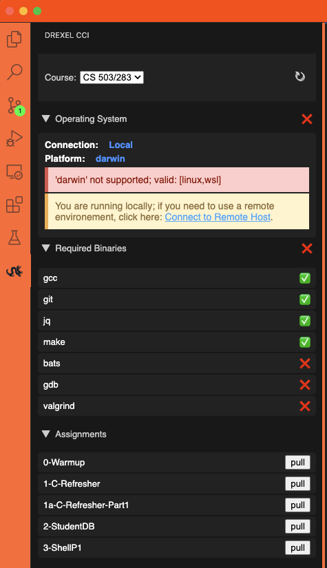
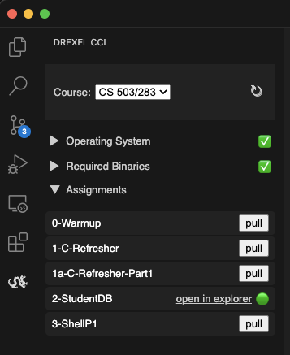

# drexel-cci

A helper for Drexel College of Computing and Informatics (CCI) students and faculty.

# Basic Usage

To get started, simply install the extension and click on the dragon icon in the primary sidebar.

> Tip: for courses that require linux, install the extension on a remote host, like an OrbStack VM, Drexel's tux environment, Windows WSL, or another support remote host.

Here is how it might look if you are not running on a supported host:

# Pulling Assignments

Assignment instructions and starter code can be pulled by clicking the "pull" button next to the assignement name. If a folder already exist in your workspace, a link to navigate to it is provided.

- You must have a workspace folder open, and that folder must be a git repo (contains a .git directory)
- If an assignement folder already exists locally, the extension will not allow you to pull and overwrite it; **if, and only if, you want to start over from scratch on an assignement, you can delete the folder locally, then pull again with the extension**

## Features

- Verifies you local operating system and environment
- Provides terminal commands to install missing binaries
- Pulls assignement direction and starter code into your local workspace

## Requirements

None

## Extension Settings

None

## Known Issues

None

## Release Notes

- 1.0.2 - initial release